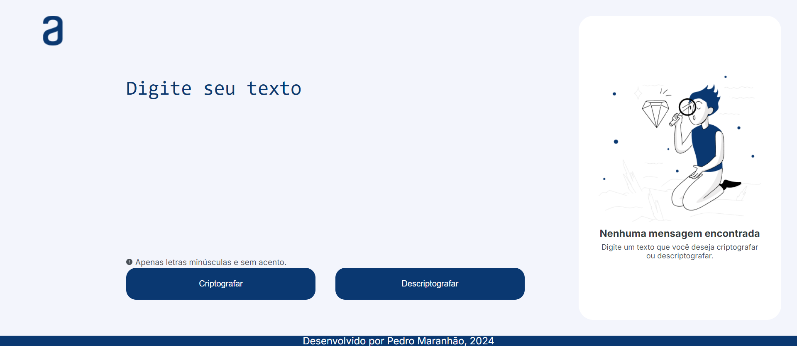

<h1>Criptógrafo</h1>

<h2>Sobre</h2>

Projeto de criptografia de textos que contém função de descriptografar os textos criptografados segundo a lógica da criptografia do projeto

<h2>Detalhes</h2>
<ul>
<li>O projeto realiza criptografia de um texto inserido pelo usuário de acordo com trocas de caracteres predefinidas</li>
<li>O usuário tem as opções de criptografar ou descriptografar o texto escolhido e também conta com um botão de copiar o texto de saída dessas opções</li>
<li>O texto inserido pelo usuário deve não pode conter letras maiúsculas ou caracteres especiais</li>
</ul>

<h2>Recursos</h2>
<ul>
  <li>Responsivo</li>
  <li>Identificação visual para botões clicados</li>
  <li>Remoção e adição de estruturas ou elementos em decorência de funcionalidade ou resposividade</li>
</ul>

<h2>Mais informações</h2>

Projeto desenvolvido como requisito de qualificação da primeira fase do curso Oracle ONE, uma parceria entre a Oracle e a Alura para capacitação de desenvolvedores

